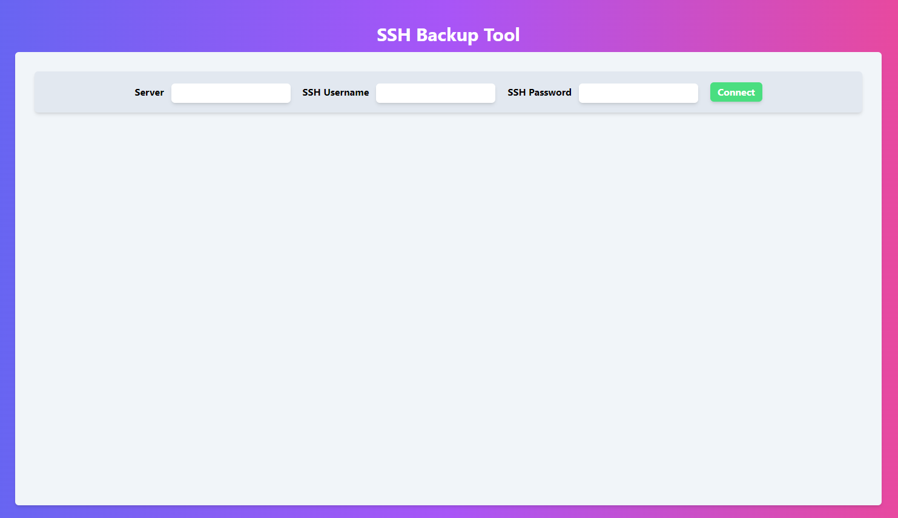
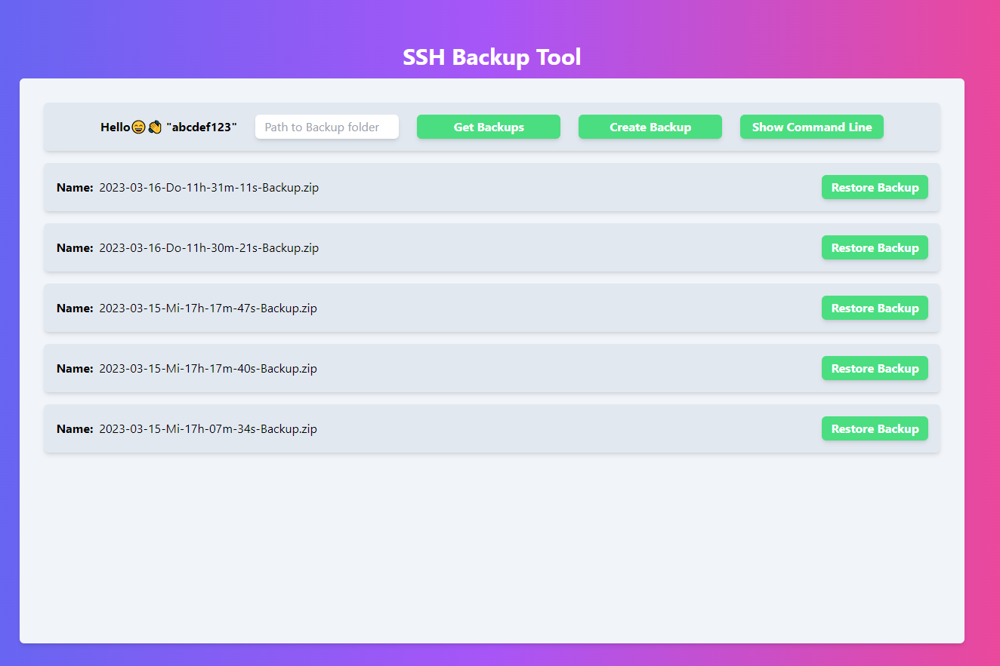
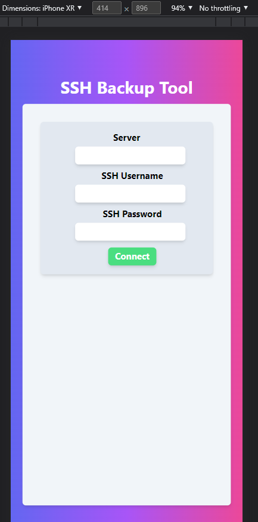
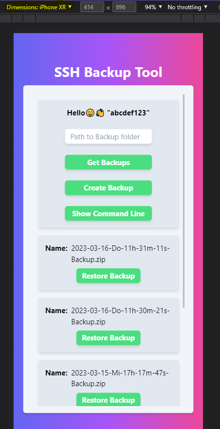
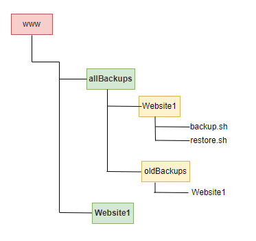
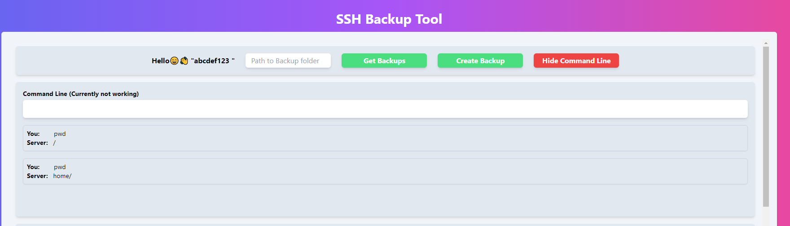

# 👾🕷️ SSH-Backup Tool 🕷️👾

**With this tool you can create or restore backups.**

The user interface is fully responsive. If the project is hosted on the internal server, you can create/restore backups from youre phone or tablet.





<br>

## How to setup ❓

> 1. Git clone the Project
> 2. Install all dependecies with **"npm install"**
> 3. Run the Project with **"npm run dev"**
> 4. Open **"localhost:3000"** in the Browser

## Now you have to configure a few things on the server ⚙️

I recommend that you create a folder called allBackups. This folder contains the backups of all projects. **Example: allBackups/projectA/**. However, where you store the backups and what the folder is called is up to you.

I recommend this folder structure: <br>


Now you need to copy the following 2 scripts from the Scripts folder to the server.

```
./Scripts/backup.sh
./Scripts/restore.sh
```

You can copy the scripts via FTP or you can create them on the server **(Do not forget to copy the contents of the scripts into the created files)**.

It is important that the scripts are named **restore.sh** and **backup.sh**. <br><span style="color:red"> **⚠️If the files are not named correctly this tool will not work.⚠️**</span>

Give the scripts the required permission with

```sh
chmod 777 restore.sh && chmod 777 backup.sh
```

<br>

### <span style="color:red">**⚠️ All backup folders must contain these 2 scripts.**</span>

After you have copied the scripts you need to customize them.<br><br>

The backup script deletes the oldest backup as soon as the number of maximum backups is exceeded.

# Backup & Restore Script ♻️🛠

There are 4 scripts in the Scripts folder.

**_backup.sh & restore.sh_** only backups and restores the project folder.<br>
**_backupAll.sh & restoreAll.sh_** backups and restores the project folder and the database.

For the mysql database the script was already written for other databases like (mssql, postgres, ...) the script must be adapted. <br>

> **⚠️❗️ The instructions are in the scripts. Please read the code and adjust the required variables. Make a security backup before the very first time you run it, important data may be deleted if you specify wrong paths.**

<br>

> **⚠️❗️ I take no responsibility for any kind of damage on the server. Please be careful you can delete important files/folders and cause big damages on a productive server.**

<br>

<br> <br>

# 🔍🚀 How to use the UI Tool

1. Login
2. Enter the path to the backup folder
3. Get all backups or create a new backup
4. Restore a backup

### The command line is curently not working.


<br>
<br>


